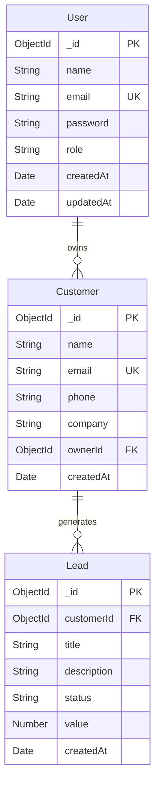

# Mini CRM – Full Stack MERN Application

This project demonstrates backend, frontend, database, and integration expertise using the **MERN stack**.

---
## 📸 Project Preview

# **Demo Video:** [Watch here](https://drive.google.com/open?id=1oXlP1TMBQBXHjqe9jkCUdSv9GlzH7GbK&usp=drive_copy)

---

## ✨ Features

### Authentication
- Register new users
- Secure login with JWT
- Passwords stored as bcrypt hashes
- Protected routes

### Customers Management
- Add, edit, delete customers
- Pagination & search by name/email
- View customer details (with associated leads)

### Leads Management
- Each customer can have multiple leads
- Fields: title, description, status (New, Contacted, Converted, Lost), value, createdAt
- CRUD operations for leads
- Filter leads by status

### Dashboard & Reports
- Metrics: total customers, total leads, new customers, conversion rate
- Charts: 
  - Leads by status (Pie/Bar)
  - Leads in last 7 days (Line/Bar)
- Top customers diagram
- Recent leads table
- Reports tab with customer & lead summary tables

### Bonus (Implemented)
- Context API for state management
- Request validation with Yup.
- Responsive design (desktop & mobile)
- Toast notifications for feedback
- Deployed backend + frontend

---

## 🛠️ Tech Stack

### Frontend
- React (Vite)
- Tailwind CSS + ShadCN UI
- React Router DOM
- Axios
- Recharts
- Context API
- Request validation with Yup.

### Backend
- Node.js + Express.js
- MongoDB Atlas + Mongoose
- JWT for authentication
- bcrypt for password hashing
- Morgan for logging
- CORS enabled

---

This project follows a **full-stack React + Node.js architecture** with:

- **Frontend**: React 18 with Vite, Tailwind CSS, and shadcn/ui components
- **State Management**: Redux Toolkit for global state
- **Backend**: Node.js with Express.js REST API
- **Database**: Configured through db.js (MongoDB)
- **Authentication**: JWT-based auth with protected routes
- **Styling**: Tailwind CSS with custom theme configuration

## Key Design Patterns

- **Feature-based organization** for scalable code structure
- **Component composition** with reusable UI elements
- **Separation of concerns** between controllers, models, and routes
- **Context API** for global application state
- **Middleware pattern** for authentication and authorization

## Schema

# ⚙️ Project Setup

This document explains how to set up and run the project locally.  
The application is built using the **MERN stack**: MongoDB, Express, React, and Node.js.

---

### Notes
- Deployed on Render (backend) & Vercel (frontend).
- Free-tier hosting may cause initial cold start delays.
- Use provided test credentials for quick access.

### Evaluation Highlights
- Clean & modular code
- Proper architecture for backend & frontend
- Fully functional: Auth, customers, leads, dashboard, reports
- Responsive UI & modern design
- Deployment done (frontend + backend)
- Bonus features implemented (charts, toast, context API)

### Thank You
